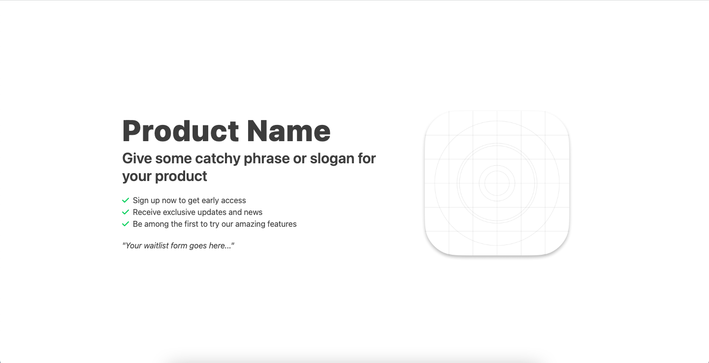

# Waitlist Template Website



This is a simple one-page waitlist template website created using [Tailwind CSS](https://tailwindcss.com/). It is designed to help you collect and manage user sign-ups for your product or service launch quickly.

## Features

- Clean and minimalistic design.
- User-friendly hero section.
- Easy-to-customize with Tailwind CSS.
- Responsive layout for mobile and desktop.

## Getting Started

1. Clone the repository:

   ```bash
   git clone https://github.com/rprav-n/waitlist-website-template.git
   ```

2. Change directory to the repo

   ```bash
   cd waitlist-website-template
   ```

3. Install the packages
    ```bash
    npm install
    ```

4. Run the follwing command to "Start the Tailwind CLI build process"
    ```bash
    npx tailwindcss -i ./src/input.css -o ./dist/output.css --watch
    ```

5. Run the "Live Server" on index.html file